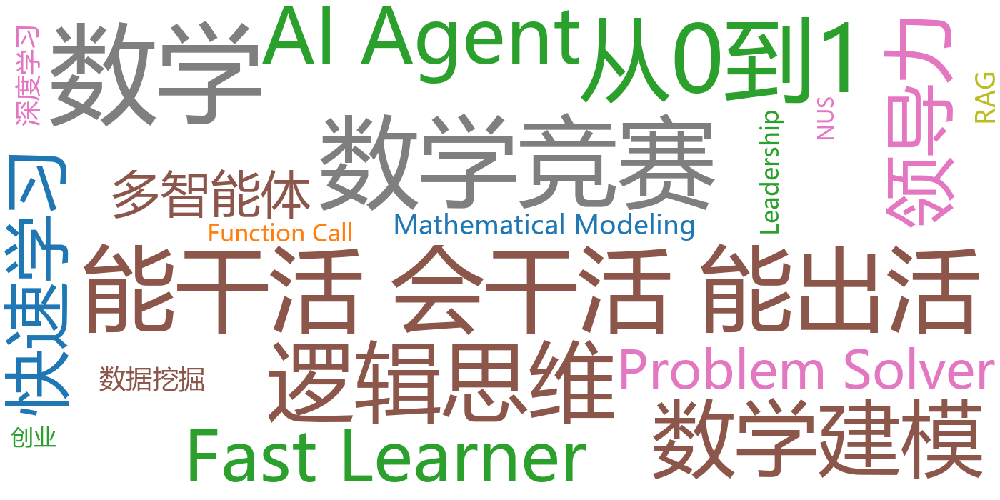

# 吴宇歌 | Yuge Wu

**AI Agent 研发工程师 | 多模态生成式AI | 大模型智能体 | LLM驱动的文本分析**

📍 新加坡 · 广州 | 📧 yugewu@u.nus.edu | 📱 +65 8865 3249 / +86 133 4721 0950

---

## 👋 关于我

7年工作经验（含3年自主创业+4年政府采购中心首席创新官），现于**新加坡国立大学（NUS）攻读AI for Science硕士**，研究方向为**多模态生成式AI、大模型智能体、LLM驱动的文本分析**。

数学竞赛生背景（全国高中数学联赛省一等奖、CGMO银牌、高考数学148分/全省前万分之一），中南大学信息管理与信息系统专业**第一名毕业**（GPA 91.91/100）。

主导全国首个公共采购智能体协同管理平台「彩翼」的架构设计与研发，已实现商业化运营；牵头多模态AI远程异地评标异常行为识别系统，与视源股份（MAXHUB）联合研发并计划全国推广。

> **求职意向：** AI Agent 研发 | 2027届毕业生

---

## 🎓 教育背景

### 新加坡国立大学（NUS）| 硕士
**科学人工智能（AI for Science）** | 2026.08 – 2027.07

- **核心课程：** 贝叶斯统计与机器学习、自然语言处理、基于机器学习的文本处理与解析、高级分类数据分析
- **研究方向：** 多模态生成式AI、大模型智能体、LLM驱动的文本分析
- **研究助理：** 导师 Abel Yang，AI辅助定性文本分析研究（[详见科研项目仓库](https://github.com/Sheroisshero/ai-assisted-content-analysis)）

### 中南大学 | 本科
**信息管理与信息系统** | 2015.09 – 2019.06

- **GPA：** 91.91/100（**4.0/4.0**，专业第**1/63**）
- **本科毕业论文：** 《基于数据挖掘与深度学习的毕业生信息跟踪系统设计与实现》（成绩：优，16学分）
- **荣誉：** 国家奖学金、省优秀毕业生、优秀毕业论文特等奖（2/566）、MCM/ICM 美国大学生数学建模竞赛 M奖、一等奖学金、优秀学生
- **证书：** 高级系统架构师（工信部）
- **核心课程：** 数据库应用、JAVA、软件测试、系统分析、数据结构
- **海外交流：** Mitacs Globalink 加拿大本科生研究实习项目（留基委全额资助，维多利亚大学，2018.08–2019.01）| [官方公示](https://iecd.csu.edu.cn/info/1015/4112.htm)
- **其他教育：** 和君商学院（已毕业）

### 湖南师范大学附属中学 | 高中
**数学竞赛生** | 2012.09 – 2015.06

- 全国高中数学联赛**省级一等奖**
- 中国女子数学奥林匹克（CGMO）**银牌**（入选湖南省队，全省选拔4人参赛）
- 高考数学**148分**（全省前万分之一）

---

## 🔬 研究经历

### 新加坡国立大学 | 研究助理
**AI辅助定性文本分析研究** | 导师：Abel Yang | 2026.08 – 2027.05

**技术栈：** Embeddings · LLM · NLP · 定性文本分析 · Human-in-the-Loop · Python · AIS Gym

- 基于 Embeddings+LLMs 完成实验框架搭建与基线模型验证，初步结果显示 Embeddings+LLM 方法在定性编码一致性上明显优于传统方法
- 当前正在实施 Human-in-the-Loop 标注流程，缓解大模型偏见与幻觉问题
- 成果计划沉淀至 AIS Gym，并投稿至计算社会科学顶刊（Sociological Methods & Research 等）

🔗 **项目详情：** [ai-assisted-content-analysis](https://github.com/Sheroisshero/ai-assisted-content-analysis)（脱敏版）

### 中信证券 | 量化交易策略优化
**广州** | 2019.03 – 2019.06

- 设计数据驱动的排序/推荐算法，优化交易对匹配效率和执行策略，**交易延迟缩减25%**，策略执行成功率提升至**98.5%**
- 构建金融时序数据挖掘与分析 Pipeline，实现特征工程自动化与策略回测效率**10倍提升**

### 加拿大维多利亚大学 | 数据分析科研助理
**维多利亚（Mitacs Globalink + 留基委全额资助）** | 2018.08 – 2019.01

- 深度参与"黑命贵"（BLM）运动对2008–2018年美国大选影响项目的数据分析
- 使用 Stata、Python 独立完成**10万+条**选举数据、社会舆情数据清洗、整合分析、特征工程与模型训练
- 制作 GIS 可视化图表
- 获得 Mitacs Globalink Research Internship 完成证书

---

## 💻 核心项目经历

### 「彩翼」—— 全国首个公共采购智能体管理平台
**广州市政府采购中心 · 首席创新官** | 2024.10 – 2026.07

**技术栈：** LLM+RAG · Workflow编排 · Function Call调度 · PyTorch · LangChain · Milvus · Neo4j

- **多智能体协同架构：** 业内首创"公共采购智能体协同管理"体系，定义采购智能体分类标准、交互逻辑与协同规则；主导构建文件生成、合规审查、采购评审、合同管理**四大Agent集群**；设计 **L1-L4任务分层路由引擎**；通过共享状态存储+事件驱动消息机制解决Agent间上下文同步
- **LLM+RAG知识增强：** 基于 Milvus+Neo4j 构建**10万+法规文档**检索增强系统，Agent合规检测准确率达**98.5%**（精确率），对比纯规则基线提升超70个百分点；融合多维评分体系（合规35%+完整25%+复用25%+适配20%）实现S/A/B/C四级内容质量定级
- **数据要素治理：** 构建四大数据渠道与六大数据库，形成**83.6万份广东公告+105万份浙江公告+76.34万条公告+53.58万份合同**核心数据资产；完成2314个采购品目与14555个电商商品类目标准化映射；建立采集→AI提取→核验→聚类→评审→入库六环节标准化治理流程
- **商业化与落地成果：** **24个智能体已上架**（自研16个+第三方8个），SaaS订阅+按次调用双模式收费，Agent产品收入近**50万元**；已在**3家国企**（杭州交投/杭钢/巨化）真实业务落地，巨化实测文件编制16h→1h5m（压缩93.2%）、审查4h→20min（压缩91.7%）；服务政府采购项目累计交易额超**100亿元**，推动26家机构合作生态联盟

🔗 **项目详情：** [Caiyi-Agent-Platform](https://github.com/Sheroisshero/Caiyi-Agent-Platform) | 🌐 [官方网站](http://www.caiyigaoke.cn/)

### 「多模态AI远程异地评标专家异常行为识别」
**广州市政府采购中心 · 项目负责人** | 2025.03 – 2026.07

**技术栈：** 计算机视觉 · 边缘AI算力 · 多模态融合 · Agent闭环工作流 · 语音识别 · PyTorch

- **多模态异常行为实时识别：** 基于CV/DL（目标检测+时序行为识别双路架构），自动检测掏手机、离座、交头接耳、传递纸条等异常行为并实时告警；融合视频/音频/文本多模态数据，异常检测准确率76.3%；集成敏感词智能监测模块
- **端到端Agent闭环工作流：** 实现音视频采集→行为识别→异常预警→自动记录全链路自动化，AI自动剪辑异常片段并绑定评审事件/专家/时间戳，一键生成数字见证报告；评标效率提升**200%**，从"人盯人"升级为"AI辅助见证管理"
- **边缘算力部署与产业协同：** 依托边缘AI算力私有化部署（AI芯片DF16：32TOPS/硬件加密，配套约30台设备），数据不上云；与视源股份（CVTE/MAXHUB）通过合作创新联合研发，计划联合推广至全国各地交易中心及代理机构

🔗 **项目详情：** [bid-evaluation-behavior-recognition](https://github.com/Sheroisshero/bid-evaluation-behavior-recognition)

---

## 💼 工作经历

### 广州市政府采购中心
**首席创新官（CIO） & 业务二部主管** | 2022.10 – 2026.07

- **2024.10–2026.07：** 统筹13人团队（8人政府采购+5人AI技术研发），主导全采购链条创新研发
- **2022.10–2024.10：** 历任综合管理部、采购文件编制部、采购项目评审部办事员，扎根一线理解业务
- **2025.07–2025.10：** 借调十五运会和残特奥会广州赛区执委会接待部，作为项目负责人完成全国首例"全运会接待酒店公开招标"（预算**2.2亿元**），形成需求调查等50余份近千页汇编文献 | [需求征求意见公告](https://gdgpo.czt.gd.gov.cn/freecms/site/gd/ggxx/info/2024/8a7e419b90a6c54b0190c3db7b2272f6.html?noticeType=001059) | [招标公告（省网）](https://gdgpo.czt.gd.gov.cn/freecms/site/gd/ggxx/info/2024/8a7ebfac913cd337019178fa41654f99.html?noticeType=001011) | [招标公告（交易中心）](https://www.gzggzy.cn/jyywzfcgzfcgcggg/1008151.jhtml)
- **2026.01–2026.06：** 借调广州交易集团组织人事部，拓展工程建设招投标、国有产权交易、碳排放权交易等全要素视野，协助薪酬核算、绩效考核、干部管理工作，全权策划组织集团大型活动 | [活动报道](https://mp.weixin.qq.com/s/DgCUyzoeZnnOlSrVsFn6Mg)

**媒体报道：** [广州政采"亮真招"跑出"加速度"](http://www.cgpnews.cn/articles/66979) | [连续三年入选全国公共采购优秀案例](https://news.dayoo.com/finance/202412/17/171077_54762432.htm)

### 长沙市开福区学广培训学校有限公司
**联合创始人 & 运营负责人** | 2019.07 – 2022.10

- 联合创办教育企业（占股30%），全面统筹公司运营
- 校区布局拓展至3个，搭建50余人专业师资团队（全兼职占比40%/60%），服务学员超1500名
- 主导以K12竞赛为特色的数学课程研发

---

## 🛠 技术技能

| 领域 | 技能 |
|------|------|
| **AI/ML** | PyTorch · TensorFlow · Scikit-learn · 深度学习 · 强化学习 · 贝叶斯统计 |
| **LLM/Agent** | LangChain · Function Call · Workflow编排 · Multi-Agent协同 · RAG · Prompt Engineering · Fine-tuning |
| **NLP** | Embeddings · 文本分类 · 命名实体识别 · 主题模型 · 定性文本分析 · Whisper ASR |
| **CV** | YOLOv8 · OpenCV · MediaPipe · 目标检测 · 关键点检测 · 多目标跟踪 · 时序行为识别 |
| **数据工程** | Milvus · Neo4j · PostgreSQL · Redis · 数据治理 · 特征工程 · ETL Pipeline |
| **编程语言** | Python · Java · SQL · Stata · Shell |
| **工程化** | Git · Docker · 边缘部署 · INT8量化 · TensorRT · 知识蒸馏 · 模型剪枝 |
| **可视化** | GIS · Matplotlib · ECharts · 数据仪表盘 |
| **其他** | 高级系统架构师（工信部）· 项目管理 · 团队管理 · 标准化制定 |

---

## 🏆 获奖与荣誉

### 国家级

| 时间 | 荣誉 | 颁发机构 |
|------|------|---------|
| 2026 | 中国信息协会数据要素应用创新大赛**决赛三等奖** | 中国信息协会 |
| 2019 | 湖南省优秀毕业生 | 湖南省教育厅 |
| 2018 | 国家奖学金 | 教育部 |
| 2017 | MCM/ICM 美国大学生数学建模竞赛 **一等奖（M奖）** | COMAP（美国） |

### 数学竞赛（高中）

| 时间 | 荣誉 | 颁发机构 |
|------|------|---------|
| 2015 | 中国女子数学奥林匹克（CGMO）**银牌**（湖南省队，全省4人） | 中国数学会 |
| 2014 | 全国高中数学联赛**省级一等奖** | 中国数学会 |

### 行业/企业级

| 时间 | 荣誉 | 颁发机构 |
|------|------|---------|
| 2017 | "GTA杯"全国大学生商务谈判大赛总决赛**二等奖** | 全国商务谈判大赛组委会 |
| 2017 | 第十届花旗青年人才集团**最佳商业实践奖** | 花旗银行北京分行 |
| 2017 | "中兴杯"职业模拟挑战赛**银奖** | 中兴通讯 + 中南大学 |

### 校级

| 时间 | 荣誉 | 颁发机构 |
|------|------|---------|
| 2019 | 优秀毕业论文**特等奖**（2/566） | 中南大学 |
| 2018 | 服务外包创新创业大赛**一等奖** | 中南大学 |
| 2016-2017 | 一等奖学金 / 优秀学生 | 中南大学 |
| 2016 | 世纪海翔嘉奖表彰奖学金**二等奖** | 中南大学 |
| 2017 | 第二十届校礼仪队队长（聘书） | 中南大学 |

### 工作后

| 时间 | 荣誉 | 颁发机构 |
|------|------|---------|
| 2025 | 新时代企业党建创新优秀案例（第一届） | 红旗出版社 |
| 2025 | 第三届"金穗杯"工作创新大赛**三等奖** | 广州市直属机关联合组织 |

### 专业资格与语言

- **高级系统架构师**（工信部，2019）
- **大学英语六级（CET-6）**：559分

> 📎 完整证书清单与扫描件：[docs/certificates.md](docs/certificates.md)

---

## 📜 知识产权

### 实用新型专利（2项，均为发明人之一）

| # | 专利名称 | 专利号 | 授权日 | 证书 |
|---|---------|--------|--------|------|
| 1 | 一种音频检测预警模组、多人评审监控系统及装置 | ZL 2025 2 1801872.8 | 2026.06.26 | [📄](assets/certificates/patent-audio-detection.pdf) |
| 2 | 一种多功能便携胸牌 | ZL 2025 2 2006592.4 | 2026.07.21 | [📄](assets/certificates/patent-portable-badge.pdf) |

### 软件著作权（6项）

| # | 软件名称 | 登记号 | 登记日 | 证书 |
|---|---------|--------|--------|------|
| 1 | 彩翼公共采购智能体协同管理平台 V1.0 | 2026SR0508763 | 2026.03.31 | [📄](assets/certificates/software-copyright-caiyi.pdf) |
| 2 | 采购文件智能合规审查系统 | 2026SR0007190 | 2026.01 | - |
| 3 | 采购质疑回复函全流程智能处理系统 | 2026SR0007172 | 2026.01 | - |
| 4 | 政府采购智能问答知识库管理系统 | 2025SR2338257 | 2025.11 | - |
| 5 | 政府采购专家评审公正性溯源辅助评判系统 | 2025SR0522775 | 2025.03 | - |
| 6 | 智能咨询系统 | - | - | - |

### 发明专利（4项，申报中）

| # | 专利名称 | 申请号 |
|---|---------|--------|
| 1 | 一种基于文本特征的政府采购质疑函自动回复方法 | 202511865261.4 |
| 2 | 一种基于多知识库协同的智能咨询处理方法 | 申报中 |
| 3 | 一种面向采购智能审查系统及方法 | 申报中 |
| 4 | 一种基于大语言模型的采购质疑全流程智能处理方法及系统 | 申报中 |

### 商标
- 「彩翼」公共采购智能体协同管理平台（国内商标已注册）

> 📎 完整知识产权清单：[docs/certificates.md](docs/certificates.md) | 彩翼平台知识产权详情：[Caiyi-Agent-Platform](https://github.com/Sheroisshero/Caiyi-Agent-Platform/blob/main/docs/intellectual-property.md)

---

---

## ✍️ 个人作品与发表

### 行业文章

| 时间 | 标题 | 发表平台 | 链接 |
|------|------|---------|------|
| 2026 | 从合规到创效！广州政采如何"智"领风骚？ | 中国招标（微信公众号） | [🔗 阅读原文](https://mp.weixin.qq.com/s/S4kM_nM-MnwKJL8NiZFQVQ) |
| 2026 | 一封安全通报引发的"五层防御"攻坚战：CVSS 6.1存储型XSS漏洞修复实战 | CSDN（Yuge Wu） | [🔗 阅读原文](https://blog.csdn.net/2601_94990104/article/details/165345527) |
| 2026 | AI技术扫盲贴：一份面向入门者的AI核心技术全景指南 | CSDN（Yuge Wu） | [🔗 阅读原文](https://blog.csdn.net/2601_94990104/article/details/164293557) |

> 本文为本人独立撰写，围绕广州市政府采购中心在智能化转型中的实践与思考，探讨从合规审查到价值创造的路径。

## 🌟 其他亮点

### 中南大学第二十届校礼仪队队长
- 统筹首届校礼仪风采大赛及20周年庆典，吸引200余名杰出校友返校
- 组织国旗班与礼仪队工作汇报会 | [官方报道](https://bs.csu.edu.cn/info/1046/1386.htm)
- 毕业季专题报道"年华的样子" | [红网](https://hn.rednet.cn/content/2019/07/08/5699035.html) / [百家号](https://baijiahao.baidu.com/s?id=1638481488086654755&wfr=spider&for=pc)
- 负责团队管理、活动策划、对外联络

### 广东省采购服务标准化技术委员会（GD/TC 121）秘书处负责人
- 牵头制定10+采购智能化技术标准
- 推动行业标准化建设

### 十五运会接待酒店招标项目负责人
- 全国首例"全运会接待酒店公开招标"，预算2.2亿元，无先例可循 | [广东赛区项目](https://www.ccgp.gov.cn/cggg/dfgg/gkzb/202508/t20250819_25188422.htm) | [氛围营造项目](https://gdgpo.czt.gd.gov.cn/maincms-web/noticeGd?type=notice&id=da9fe07c-865a-4dd7-8527-59255ad9d711&channel=fca71be5-fc0c-45db-96af-f513e9abda9d&noticeType=001011&openTenderCode=CZ2025-0959&channelName=%E9%A1%B9%E7%9B%AE%E9%87%87%E8%B4%AD%E5%85%AC%E5%91%8A)
- 无先例可循，形成50余份近千页汇编文献

---

## 📂  GitHub 项目

| 仓库 | 说明 | 技术栈 |
|------|------|--------|
| [Caiyi-Agent-Platform](https://github.com/Sheroisshero/Caiyi-Agent-Platform) | 全国首个公共采购智能体协同管理平台技术方案与架构设计 | Multi-Agent · LLM+RAG · Function Call · Workflow · Knowledge Graph |
| [bid-evaluation-behavior-recognition](https://github.com/Sheroisshero/bid-evaluation-behavior-recognition) | 多模态AI远程异地评标专家异常行为识别系统 | CV · ASR · 多模态融合 · 边缘AI · Agent工作流 |
| [ai-assisted-content-analysis](https://github.com/Sheroisshero/ai-assisted-content-analysis) | NUS科研项目：AI辅助定性文本分析（脱敏版） | Embeddings · LLM · NLP · Human-in-the-Loop |

---

## 📚 文档导航

| 文档 | 说明 |
|------|------|
| [docs/about.md](docs/about.md) | 个人简介与职业轨迹 |
| [docs/education.md](docs/education.md) | 教育背景详览（高中→本科→硕士） |
| [docs/experience.md](docs/experience.md) | 工作经历详览 |
| [docs/projects.md](docs/projects.md) | 核心项目详览 |
| [docs/awards.md](docs/awards.md) | 获奖与荣誉（15项） |
| [docs/certificates.md](docs/certificates.md) | 证书与知识产权汇总（含扫描件） |
| [docs/media-links.md](docs/media-links.md) | 媒体报道与公开链接 |

---

## 📬 联系方式

- **邮箱：** yugewu@u.nus.edu
- **电话：** +65 8865 3249（新加坡）/ +86 133 4721 0950（中国）
- **GitHub：** [github.com/Sheroisshero](https://github.com/Sheroisshero)
- **位置：** 新加坡 / 广州

---

## 🛠️ My favorite tools and technologies

  
  
  
  
  
  
  
  
  
  
  

---

## 🔑 个人关键词 | Keywords

  

---

*最后更新：2026年9月 | 本页面为在线简历，持续更新中*

